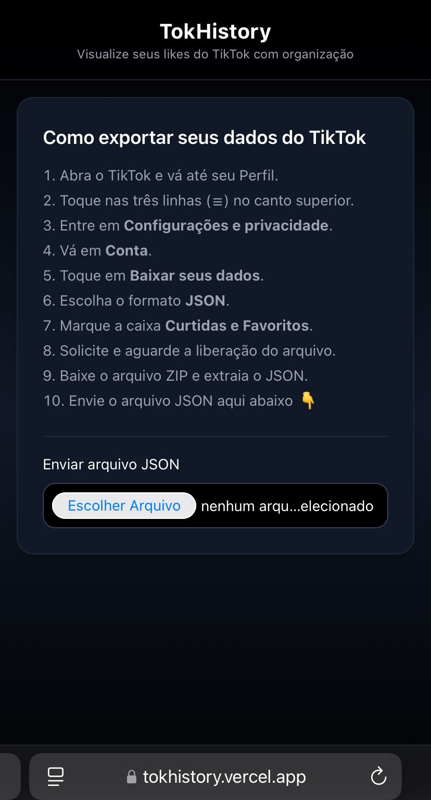

# TokHistory

Visualize e organize seus vídeos curtidos do TikTok usando o arquivo JSON exportado oficialmente.

Seus dados são processados 100% no navegador. Nada é enviado para servidores.

## 🔥 Demo

Acesse aqui:
[https://tokhistory.vercel.app](https://tokhistory.vercel.app)

---

## 📸 Preview

### Mobile Home

<p align="center">
  
</p>

### Mobile Preview

<p align="center">
  
</p>

## 🎯 Problema

O TikTok não permite ordenar os vídeos curtidos cronologicamente (do mais antigo para o mais recente).  
Além disso, a aba de curtidos utiliza scroll infinito, dificultando a navegação.

O TokHistory resolve isso permitindo:

- Ordenação por data
- Filtro por ano
- Paginação
- Player embutido
- Interface otimizada para mobile

---

## 🛠️ Como funciona

1. No TikTok, vá em:
   Perfil → Configurações e privacidade → Conta → Baixar seus dados
2. Escolha o formato **JSON**
3. Faça upload do arquivo no TokHistory
4. Navegue seus likes com filtros e organização

Todos os dados são processados localmente no navegador.

---

## 🚀 Funcionalidades

- Upload de JSON oficial do TikTok
- Parser tipado e seguro
- Validação de erro para JSON inválido
- Ordenação ascendente e descendente
- Filtro por ano
- Paginação performática
- Scroll automático entre páginas
- Player embutido do TikTok
- Interface dark responsiva

---

## 🧠 Tecnologias Utilizadas

- React
- TypeScript
- Vite
- TailwindCSS
- Vercel (deploy)

---

## 💻 Rodando localmente

Clone o repositório:

```bash
git clone https://github.com/SEUUSUARIO/tokhistory.git
cd tokhistory
npm install
npm run dev
